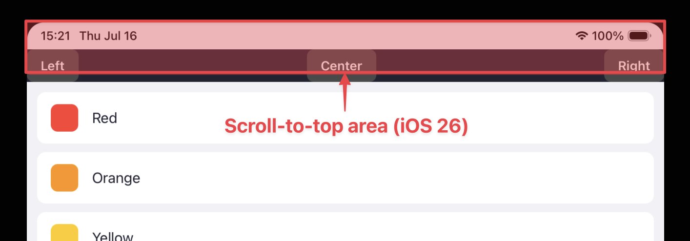
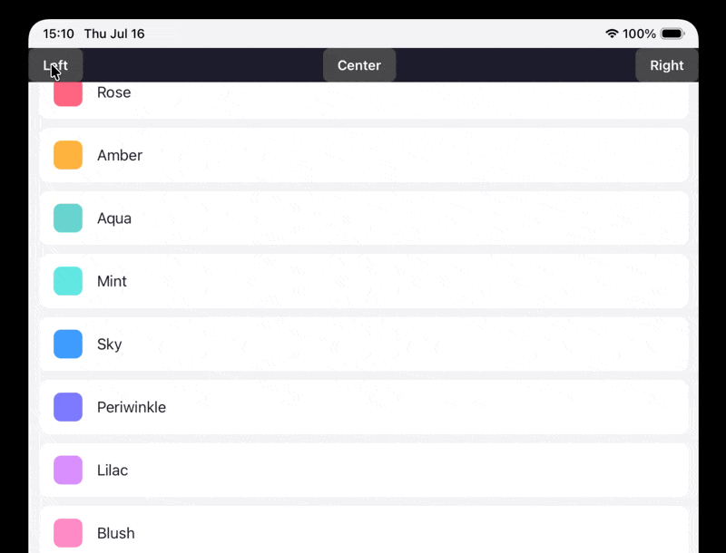

# RN Native Touch Control

A React Native view backed by a real native iOS `UIControl`. Its presence in the view hierarchy makes iOS treat the region as an interactive control, so system behaviors that defer to controls skip over it.

The primary use case is scroll-to-top. On iOS, tapping the status bar scrolls the nearest scroll view to the top. It also fires when the tap lands on a button in the top bar, so the button press and the scroll happen at once. On iPad it can be worse: if the button navigates back, the scroll hits the previous screen's scroll view instead of the current one. Hosting the button in a `NativeTouchControl` opts the region out.

### iOS 26+

The scroll-to-top tap target used to be the status bar only, a thin strip that rarely overlapped interactive UI. iOS 26 extended it over much of the navigation bar, where apps commonly place back buttons, titles, and other controls.

<p align="center">
  
</p>

Taps meant for nav-bar controls now often land inside the scroll-to-top zone and trigger an unwanted scroll. `NativeTouchControl` opts those regions out.

> [!NOTE]
> This is an **iOS-only** behavior. On Android the component is a plain passthrough container (see [Platform support](#platform-support)).

## Demo

<p align="center">
  
</p>

The nav-bar buttons sit in the status-bar tap zone. Each hosts a `NativeTouchControl` on top of its content, so pressing them does not scroll the list to the top. The example uses both the wrapper and the overlay-sibling forms. A runnable version lives in [`example/`](./example).

## Installation

```sh
npm install react-native-touch-control
```

Then install pods (or let your build do it):

```sh
cd ios && pod install
```

This library uses the New Architecture (Fabric). No extra linking steps are required beyond autolinking.

## Usage

`NativeTouchControl` accepts all standard `View` props and lays out like any other view. There are two equally valid ways to use it. Both place the native `UIControl` **on top of your content**, which is the condition iOS's scroll-to-top detection checks (see [How it works](#how-it-works)).

### Use case 1: as a wrapper

Nest content inside `NativeTouchControl`. The control spans the region, and its children render beneath it:

```tsx
import { NativeTouchControl } from 'react-native-touch-control';

function TopBarButton({ label, onPress }) {
  return (
    <Pressable onPress={onPress}>
      {/* UIControl on top of the label, so iOS skips scroll-to-top here. */}
      <NativeTouchControl>
        <Text>{label}</Text>
      </NativeTouchControl>
    </Pressable>
  );
}
```

Use this form when the control should cover exactly the content.

### Use case 2: as an overlay sibling

Render `NativeTouchControl` as a `StyleSheet.absoluteFill` **sibling** of the content, placed **last** so it stays topmost. This covers the whole parent, including any padding a wrapper would leave exposed. It has no children, so render it only on iOS:

```tsx
import { Platform, StyleSheet } from 'react-native';

<Pressable style={styles.button} onPress={onPress}>
  <Text style={styles.label}>{label}</Text>
  {/* Fills the whole Pressable, padding included. */}
  {Platform.OS === 'ios' && (
    <NativeTouchControl style={StyleSheet.absoluteFill} />
  )}
</Pressable>;
```

Use this form when the tappable area is larger than the content itself (padding, hit slop, a whole card).

### `NativeTouchControl` must be _inside_ the `Pressable`

In both use cases, the `Pressable`/`Touchable` must be an **ancestor** of `NativeTouchControl`. Nest the control inside it, not around it. React Native routes the tap **up** the tree to the responder, so a `Pressable` inside `NativeTouchControl` never fires `onPress`.

```tsx
// ✅ Works — Pressable is an ancestor of NativeTouchControl
<Pressable onPress={onPress}>
  <NativeTouchControl>
    <Text>{label}</Text>
  </NativeTouchControl>
</Pressable>

// ❌ Never fires onPress — Pressable is a descendant
<NativeTouchControl>
  <Pressable onPress={onPress}>
    <Text>{label}</Text>
  </Pressable>
</NativeTouchControl>
```

## How it works

React Native and iOS run two independent touch systems. RN's responder system handles `Pressable`, `Touchable*`, and gesture handlers in JavaScript, while UIKit dispatches touches to native views in parallel. The two do not coordinate, so handling a press in JS does not stop UIKit from also acting on the same tap. That is why an ordinary `Pressable` in the nav bar still triggers scroll-to-top: to UIKit there is no native control there, only a tap in the scroll-to-top zone.

On iOS, scroll-to-top is driven by a private gesture recognizer, `_UIDoubleTapInteractionGestureRecognizer`, that watches the status-bar region. Before scrolling, it hit-tests the touch and checks whether the topmost view there is an interactive `UIControl`. If it is, the recognizer assumes the tap belongs to that control and does not scroll.

`NativeTouchControl` relies on this check. The native view is a plain `UIControl` with no target/action, a passive marker whose presence as the topmost view is enough for the recognizer to skip scroll-to-top.

The two use cases are equivalent because both put the `UIControl` **on top of the content** at the tapped point: beneath the content in the wrapper form, in front of it in the overlay form. Either way the hit-test resolves to the `UIControl`. Since this is a general UIKit hit-test and not a scroll-to-top-specific hook, the same approach opts a region out of other system behaviors that defer to `UIControl`s.

Two implementation details:

- The control is stretched to the view's **full bounds**, padding included, so no uncovered edge is left where a tap could reach the system behavior.
- React children mount beneath the control, so transparent regions show the content through while the control overlays the whole area.

## Platform support

| Platform | Behavior                                                                                                                    |
| -------- | --------------------------------------------------------------------------------------------------------------------------- |
| iOS      | Renders a native `UIControl` region that opts the area out of `UIControl`-deferring system behaviors such as scroll-to-top. |
| Android  | No-op passthrough. Renders its children like an ordinary view. There is no equivalent scroll-to-top behavior to suppress.   |

Because it is a no-op on Android, the component can be used in cross-platform code without branching.

## Contributing

- [Development workflow](CONTRIBUTING.md#development-workflow)
- [Sending a pull request](CONTRIBUTING.md#sending-a-pull-request)
- [Code of conduct](CODE_OF_CONDUCT.md)

## License

MIT

---

Made with [create-react-native-library](https://github.com/callstack/react-native-builder-bob)
